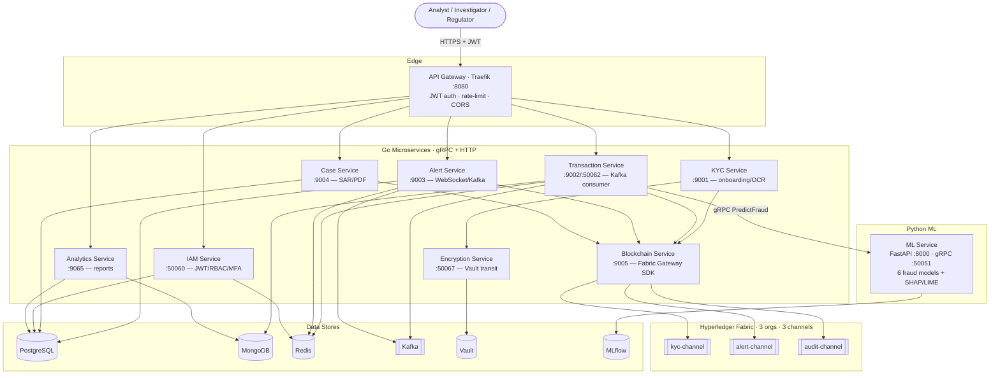
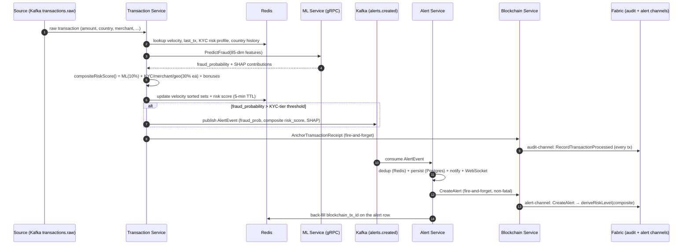
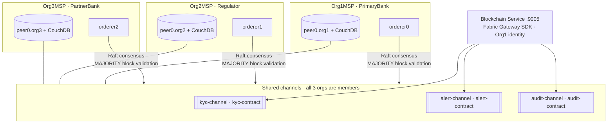
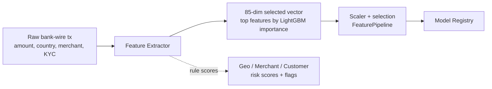
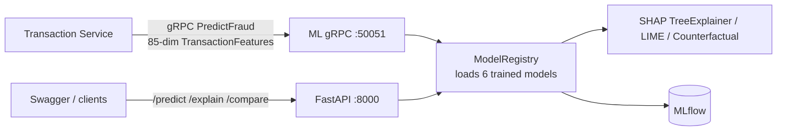

# System Architecture — Blockchain-Based KYC/AML Fraud Detection Platform

> Thesis project — Mayesha Marzia Zaman Mim.
> A production-grade platform that combines **Hyperledger Fabric** immutable audit
> trails with **ML-powered fraud intelligence** behind a microservice backbone.

This document describes three layers:
1. [Full System Architecture](#1-full-system-architecture)
2. [Blockchain Architecture](#2-blockchain-architecture)
3. [Machine-Learning Architecture](#3-machine-learning-architecture)

It reflects the current build, including the **hybrid composite risk score** and
**alert-channel anchoring** added in the latest iteration.

---

## 1. Full System Architecture

### 1.1 High-level diagram



### 1.2 Services

| Service | Lang | Port(s) | Responsibility |
|---------|------|---------|----------------|
| API Gateway | Go (Traefik) | 8080 | Single ingress; JWT validation, rate-limiting, CORS, routing |
| IAM Service | Go | gRPC 50060 | Authn (JWT access 15m / refresh 7d), RBAC, TOTP MFA |
| KYC Service | Go | HTTP 9001 | Customer onboarding, OCR, identity hashing, blockchain KYC write |
| Transaction Service | Go | HTTP 9002 / gRPC 50062 | Kafka consumer, feature extraction, ML call, **composite risk score**, alert routing |
| Alert Service | Go | HTTP 9003 | Kafka consumer of `alerts.created`, dedup, notifications, WebSocket push, **alert-channel anchor** |
| Case Service | Go | HTTP 9004 | Investigation cases, SAR PDF generation, S3 upload, audit anchor |
| Analytics Service | Go | HTTP 9065 | Aggregated reports and dashboard metrics |
| Encryption Service | Go | gRPC 50067 | Vault transit AES-256-GCM encrypt/decrypt of PII |
| Blockchain Service | Go | HTTP 9005 | Fabric Gateway SDK wrapper; all chaincode read/write |
| ML Service | Python | HTTP 8000 / gRPC 50051 | FastAPI + gRPC fraud scoring; SHAP/LIME explainability |

### 1.3 Data stores

| Store | Used by | Purpose |
|-------|---------|---------|
| PostgreSQL | IAM, KYC, Alert, Case | Relational records (users, customers, alerts, cases) |
| MongoDB | Transaction | Time-series enriched transactions + feature snapshots |
| Redis | Transaction, IAM, KYC, Alert | Velocity windows, KYC risk profile, risk-score TTL, JWT cache, alert dedup |
| Kafka | Transaction, Alert | `transactions.raw`, `alerts.created`, `kyc.events` topics |
| Vault | Encryption + all | AES-256-GCM PII encryption at rest (transit engine) |
| MLflow | ML | Model experiment tracking, metrics, artifacts |

### 1.4 End-to-end transaction processing pipeline



**Key guarantees**
- A `TRANSACTION_PROCESSED` receipt is anchored on `audit-channel` for **every**
  ML-scored transaction — flagged or not. The regulator's own peer can detect a
  missing receipt without trusting the bank (*fabrication-gap closure*).
- Alert anchoring and audit anchoring are **fire-and-forget and non-fatal** — they
  never block or fail the transaction pipeline.

---

## 2. Blockchain Architecture

### 2.1 Network topology



- **3 organizations:** `Org1MSP` (PrimaryBank), `Org2MSP` (Regulator), `Org3MSP` (PartnerBank).
- **3 Raft orderers**, one per org; block validation policy = **MAJORITY** (≥2 of 3 sign every block).
- **CouchDB** state database per peer (rich JSON queries for indexes).
- All 3 orgs are members of all 3 channels (regulator mandate + cross-institution fraud signal).
- The **Blockchain Service** is the only writer/reader, connecting via the Org1 Gateway connection profile; the Fabric Gateway SDK auto-discovers endorsers to satisfy the chaincode endorsement policy (majority).
- Measured commit latency: ~400–900 ms (acceptable for the async fraud pipeline).

### 2.2 Channels, chaincodes & key functions

| Channel | Chaincode | Key functions | Records |
|---------|-----------|---------------|---------|
| `kyc-channel` | kyc-contract | RegisterCustomer, UpdateKYCStatus, GetKYCRecord, GetRiskLevel, GetKYCHistory | Identity hash, KYC status, risk level |
| `alert-channel` | alert-contract (**v1.1**) | CreateAlert, UpdateAlertStatus, GetAlert, GetAlertsByCustomer, GetAlertsByRiskLevel, GetAlertStats | Fraud alert record + investigation status |
| `audit-channel` | audit-contract | RecordTransactionProcessed, RecordModelPrediction, RecordSARFiled, RecordInvestigatorAction, GetAuditTrail, GetComplianceReport | Processing receipts, SAR hashes, investigator actions |

### 2.3 On-chain record shapes (representative)

```
AlertRecord (alert-channel)         AuditRecord (audit-channel)
  alertID        string               recordType   TRANSACTION_PROCESSED | SAR_FILED |
  customerID     string                            INVESTIGATOR_ACTION | MODEL_PREDICTION
  txHash         string               entityType   TRANSACTION | CASE | CUSTOMER
  fraudProb      float                entityID     <tx_hash | case_id | ...>
  riskScore      float (0–100 composite)  data     {... domain fields ...}
  riskLevel      LOW|MEDIUM|HIGH|CRITICAL  hash     SHA-256 of the record
  status         OPEN|...              txId         Fabric transaction id
  txId           Fabric tx id          createdAt    RFC3339
```

### 2.4 Alert risk-level derivation (v1.1 — composite-driven)

The `alert-contract` `deriveRiskLevel` originally keyed on the raw ML probability,
which is a narrow band on the adapted feature space → every alert collapsed to LOW.
**v1.1** keys on the upstream **composite risk score** (0–100):

```
deriveRiskLevel(riskScore):
    riskScore > 85   → CRITICAL
    riskScore >= 70  → HIGH
    riskScore >= 50  → MEDIUM
    else             → LOW
```

> The chaincode was upgraded on `alert-channel` to **Version 1.1, Sequence 2**,
> installed + approved on all three orgs.

### 2.5 Privacy & integrity model

- **PII never reaches the ledger.** Identity is stored as `SHA-256(document)`.
- **SAR documents** live in S3; only `SHA-256(PDF)` is anchored on `audit-channel`,
  enabling tamper-evidence without exposing the report.
- **Immutability** via SHA-256-chained blocks + MAJORITY multi-org Raft signing.
- **Fabrication-gap closure:** the regulator (Org2) independently holds the full
  `audit-channel` ledger; absence of a `TRANSACTION_PROCESSED` receipt is detectable
  without trusting the bank.
- **Future work:** Private Data Collections (PDC) for feature-level regulator-only access.

---

## 3. Machine-Learning Architecture

### 3.1 Dataset & training

- **Elliptic Bitcoin Transaction Dataset** — 203,769 transactions; 46,564 labeled
  (4,545 illicit / 42,019 licit); 166 features/node + temporal graph edges.
- **Split:** 80/20 *temporal* (time-step aware) to avoid leakage.
- **Imbalance:** SMOTE on the training split only.
- Experiments tracked in **MLflow**.

### 3.2 Feature pipeline



- Raw Elliptic CSV has 166 features → top **85** selected (indices 1–68, 94–110).
- `_structured_to_elliptic_array()` maps real bank-wire fields into **38** of the 85
  positions; the remaining **47** are zero-padded (Bitcoin-specific; no bank equivalent).
- Domain adaptation covers 6 FATF Recommendation-16 behavioral categories: value
  anomaly, velocity, geographic risk, network topology, temporal pattern, KYC profile.

### 3.3 Models

| Model | Class | Key hyperparameters |
|-------|-------|---------------------|
| Random Forest | `RandomForestModel` | 500 trees, max_depth=12, class_weight=balanced |
| XGBoost | `XGBoostModel` | 500 estimators, scale_pos_weight=9, LR=0.05 |
| LightGBM | `LightGBMModel` | 1000 leaves, is_unbalance=True, LR=0.05 |
| GNN (GraphSAGE) | `GNNFraudModel` | 3-layer 85→256→128→64→2, dropout=0.3 |
| Autoencoder | `AutoencoderModel` | 85→64→32→16→32→64→85, inverted scoring |
| Ensemble | `EnsembleModel` | Weighted avg (LGB 0.35, RF 0.33, XGB 0.32) |

**Measured benchmark (Elliptic, 80/20 temporal, SMOTE):**

| Model | Precision | Recall | F1 | ROC-AUC | PR-AUC |
|-------|-----------|--------|----|---------|--------|
| LightGBM | 64.61% | 68.18% | 66.35% | 96.49% | 69.7% |
| Random Forest | 88.34% | 56.92% | 69.23% | 96.38% | 68.2% |
| XGBoost | 70.64% | 63.24% | 66.74% | 95.97% | 69.1% |
| GNN | 22.34% | 66.45% | 33.44% | 88.86% | 54.7% |
| Autoencoder | 6.61% | 68.15% | 12.05% | 70.94% | 38.9% |

### 3.4 Serving



- 6 models loaded into memory at startup (~60–90 s warm-up).
- **SHAP** TreeExplainer (tree models) / KernelExplainer (GNN/AE); **LIME** tabular;
  **counterfactual** minimum-perturbation generator.
- SHAP values are serialized to JSON, stored in PostgreSQL (Alert Service) and
  anchored on-chain (`audit-contract` MODEL_PREDICTION).

### 3.5 Hybrid composite risk score (ML + FATF rule-based)

Because the ML probability is a narrow band on the adapted bank-wire feature space,
the **Transaction Service** blends it with the rule-based signals it already computes
into a single 0–100 score that drives alerting and the on-chain risk level:

```
compositeRiskScore =  0.10 · (fraud_probability · 100)
                    +  0.30 · CustomerRiskScore     (KYC tier)
                    +  0.30 · MerchantRiskScore      (category)
                    +  0.30 · GeographicRiskScore    (jurisdiction)
                    +  bonuses:  cross-border +12
                                 amount anomaly  up to +12
                                 high-risk merchant +6
                    →  clamped to [0, 100]
```

**Rule-score lookups (examples):**

| Signal | Examples |
|--------|----------|
| GeographicRiskScore | KP 100, IR 95, SY 90, RU 72, KY 50, US/GB/DE 10 |
| MerchantRiskScore | gambling 90, casino 88, crypto-exchange 78, cryptocurrency 75, money-transfer 68, default 15 |
| CustomerRiskScore (KYC tier) | LOW 20, MEDIUM 50, HIGH 80, CRITICAL 95 |

**FATF risk-based alert thresholds** (fraud_prob must exceed the customer's KYC-tier threshold):

| KYC tier | Threshold |
|----------|-----------|
| LOW | 0.70 |
| MEDIUM | 0.55 |
| HIGH | 0.008 |
| CRITICAL | 0.005 |

> HIGH/CRITICAL thresholds are tuned to the model's actual output band so high-risk
> customers are monitored with higher recall; the composite score then determines the
> alert *level*. (Gating alert *firing* on the composite score too is identified future work.)

### 3.6 Worked example (live, stateful)

Two identical transactions differing only in country, for one CRITICAL customer:

| | Geo | AvgAmount30D | AmountDeviation | composite | level |
|--|-----|--------------|-----------------|-----------|-------|
| crypto / **US** (1st tx) | 10 | 0 | 2000 (anomalous) | **72.08** | HIGH |
| crypto / **IR** (2nd tx) | 95 | 2000 | 0 (normal now) | **85.58** | CRITICAL |

The score is computed live from features (geography changed the geo term; transaction
history changed the amount-anomaly term) — demonstrating the pipeline is dynamic and
stateful, not static.

---

## 4. Cross-Cutting Concerns

### 4.1 Security

| Control | Implementation |
|---------|----------------|
| PII encryption | AES-256-GCM via HashiCorp Vault transit engine |
| Authentication | JWT access (15 min) + refresh (7 days, Redis) |
| Authorization | RBAC, per-endpoint fine-grained permissions |
| Rate limiting | 100 req/min public; 5 failed logins → 15 min lockout |
| MFA | TOTP (optional per user) |
| SQL injection | Parameterized queries everywhere |
| TLS | TLS 1.3 inter-service (prod); TLS on all Fabric peers/orderers |
| Immutability | SHA-256 chained blocks, MAJORITY multi-org signing |

### 4.2 Observability

- **Prometheus** (metrics) + **Grafana** (dashboards) + **Jaeger** (distributed tracing)
  across the transaction → ML → alert → blockchain flow.

### 4.3 gRPC / proto contract

`proto/` defines all inter-service contracts: `transaction.proto`, `fraud.proto`
(85-dim TransactionFeatures, FraudPrediction, SHAPContribution), `kyc.proto`,
`alert.proto`, `iam.proto`, `common.proto`. Stubs generated to `proto/gen/go` and
`proto/gen/python`.

### 4.4 Deployment

- **Local:** `docker-compose.yml` (infra) + `blockchain/network` (Fabric) + `make run` (services).
- **Cloud:** `infrastructure/terraform` (AWS EKS + RDS + MSK + ElastiCache) and
  `infrastructure/kubernetes` (Helm charts per service).

---

## 5. Recent Enhancements (current iteration)

| Area | Change |
|------|--------|
| Alert → blockchain | Alert Service now **anchors every alert on `alert-channel`** (`clients/blockchain_client.go` → `CreateAlert`), back-filling `blockchain_tx_id`. Fire-and-forget, non-fatal. |
| Risk scoring | Transaction Service emits a **hybrid composite risk score** (ML + FATF rule-based) used for alerting and the on-chain risk level. |
| Chaincode | `alert-contract` **v1.1** derives `riskLevel` from the composite score → real LOW/MEDIUM/HIGH/CRITICAL spread on-chain. |
| Ops | Peer `CORE_CHAINCODE_EXECUTETIMEOUT` raised to 300s so chaincode upgrades don't time out on first build. |

---

## 6. Known Limitations

- 47/85 model input features are zero-padded (Bitcoin-specific; no bank equivalent).
- GNN production inference degrades to feature-only (full graph inference needs a
  pre-built subgraph from the PostgreSQL edge table).
- Autoencoder uses inverted scoring (fraud has *lower* reconstruction error on Elliptic).
- SAR S3 upload requires AWS credentials; locally the PDF step is non-fatal and the
  hash still anchors on-chain.
- Alert *firing* still gates on the raw ML probability vs KYC-tier threshold; gating on
  the composite score is future work.
- PDC (Private Data Collections) for feature-level regulator-only access is future work.
