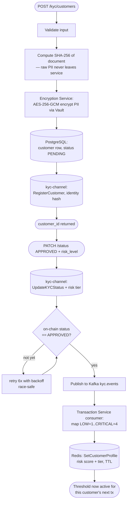
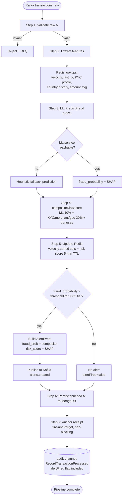
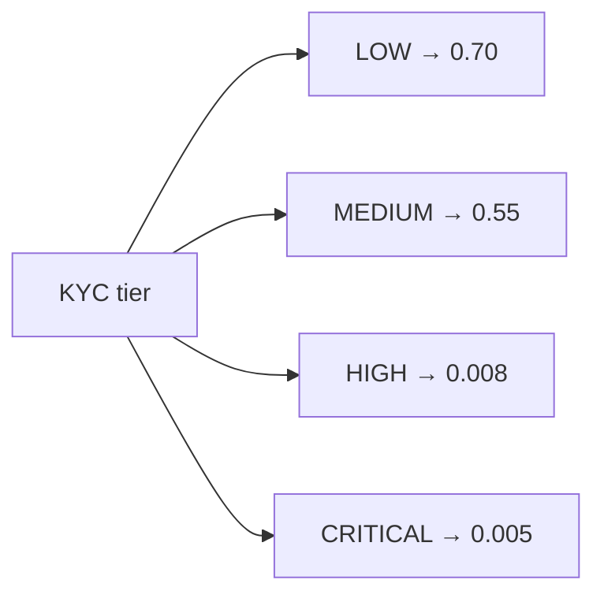
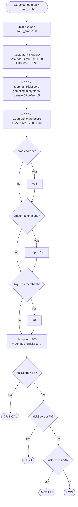
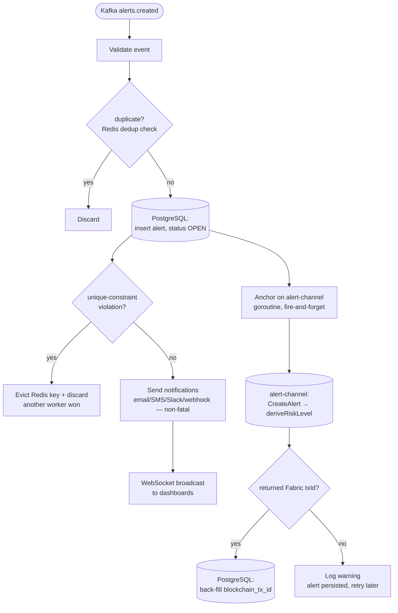
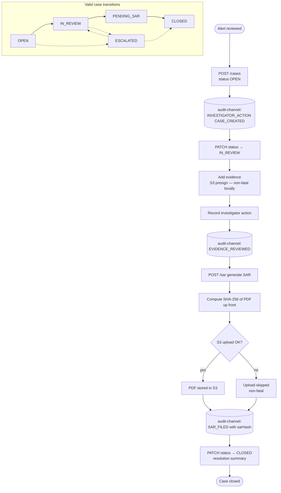
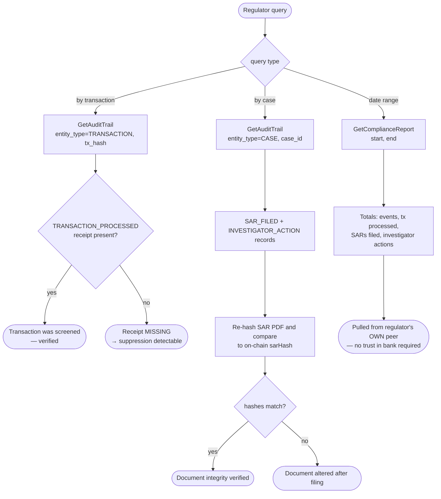
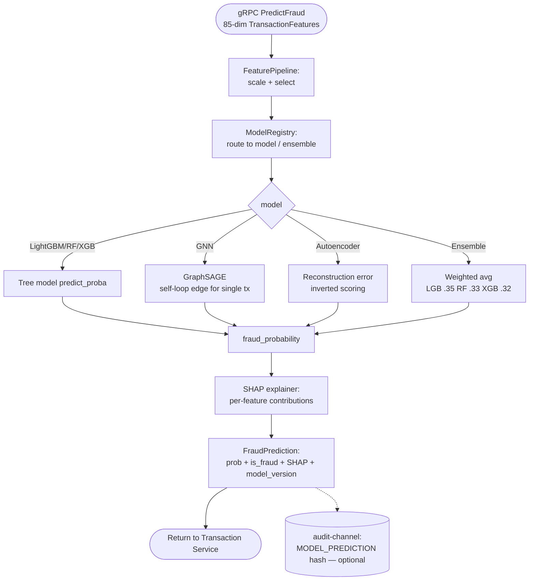

# System Flowcharts

> Decision-level flowcharts for the Blockchain-Based KYC/AML Fraud Detection
> platform. These show the **runtime logic and branch points** (the *what happens
> when* ), complementing the component diagrams in `archi.md`. All diagrams are
> Mermaid and render on GitHub.

Contents:
1. [End-to-end system flow](#1-end-to-end-system-flow)
2. [KYC onboarding flow](#2-kyc-onboarding-flow)
3. [Transaction processing pipeline](#3-transaction-processing-pipeline)
4. [Composite risk score & alert-level decision](#4-composite-risk-score--alert-level-decision)
5. [Alert ingestion & blockchain anchoring](#5-alert-ingestion--blockchain-anchoring)
6. [Case management & SAR flow](#6-case-management--sar-flow)
7. [Blockchain audit & compliance verification](#7-blockchain-audit--compliance-verification)
8. [ML inference flow](#8-ml-inference-flow)

---

## 1. End-to-end system flow

The full happy path from customer onboarding to regulator verification.

```mermaid
flowchart TD
    A([Customer onboarded]) --> B[KYC Service:<br/>register + approve]
    B --> C[(kyc-channel:<br/>identity hash + risk tier)]
    C --> D[kyc.events to Kafka]
    D --> E[Transaction Service:<br/>cache KYC risk profile in Redis]

    F([Transaction arrives<br/>Kafka transactions.raw]) --> G[Transaction Service:<br/>extract features + ML score]
    E -. risk tier used .-> G
    G --> H[Composite risk score]
    H --> I{fraud_prob &gt;<br/>KYC-tier threshold?}
    I -- yes --> J[Publish AlertEvent<br/>Kafka alerts.created]
    I -- no --> K[No alert]
    G --> L[(audit-channel:<br/>TRANSACTION_PROCESSED<br/>receipt for EVERY tx)]

    J --> M[Alert Service:<br/>persist + notify]
    M --> N[(alert-channel:<br/>CreateAlert + riskLevel)]
    M --> O[Investigator opens case]
    O --> P[Case Service:<br/>investigate + generate SAR]
    P --> Q[(audit-channel:<br/>SAR_FILED hash +<br/>INVESTIGATOR_ACTION)]

    R([Regulator / Org2]) --> S[Pull compliance report<br/>from own peer]
    L -. independently verifiable .-> S
    N -. .-> S
    Q -. .-> S
    S --> T([Tamper-evident audit<br/>— no trust in bank required])
```

---

## 2. KYC onboarding flow

How a customer's identity and risk tier become tamper-evident on-chain, and how that
tier reaches the live fraud pipeline.



---

## 3. Transaction processing pipeline

The core `ProcessTransaction` logic in the Transaction Service. Every step after
feature extraction is non-blocking on its own failure.



**KYC-tier thresholds (fraud_prob must exceed to alert):**



---

## 4. Composite risk score & alert-level decision

How the hybrid score is computed and mapped to the on-chain risk level (alert-contract v1.1).



---

## 5. Alert ingestion & blockchain anchoring

The Alert Service `IngestAlert` flow, including the alert-channel anchoring added this iteration.



---

## 6. Case management & SAR flow

From alert to a closed case with a tamper-evident SAR. Case status transitions are
enforced by the domain state machine.



---

## 7. Blockchain audit & compliance verification

How a regulator independently verifies the audit trail — the fabrication-gap-closure check.



---

## 8. ML inference flow

What happens inside the ML Service for one `PredictFraud` request.



---

### Legend

| Shape | Meaning |
|-------|---------|
| `([ ])` rounded | start / end / terminal state |
| `[ ]` rectangle | process / action |
| `{ }` diamond | decision / branch |
| `[( )]` cylinder | datastore or on-chain ledger write |
| dotted arrow `-.->` | asynchronous / verification / non-blocking link |

> Notes: blockchain writes (audit-channel / alert-channel) are **fire-and-forget and
> non-fatal** — they never block the transaction or alert pipelines. A
> `TRANSACTION_PROCESSED` receipt is anchored for **every** scored transaction, which
> is what makes non-reporting detectable (fabrication-gap closure).
